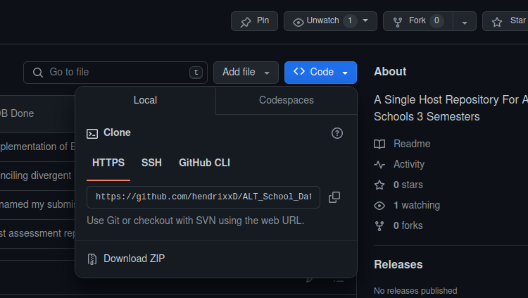
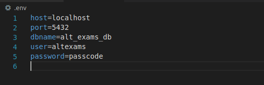

# Fall Semester Data Engineering Exams

## Synopsis
 The achieving goal of this project is to put to test and validate the knowledge OOP which we have ingested through out the the semester by implementing two classes that models and manages financial expenses.

## Classes

 ### Expense Class:
  This class represents an individual financial expense.
  
  Attributes:
   1. id: A unique identifier generated as a UUID string.
   2. title: A string representing the title of the expense.
   3. amount: A float representing the amount of the expense.
   4. created_at: A timestamp indicating when the expense was created (UTC).
   5. updated_at: A timestamp indicating the last time the expense was updated (UTC).
    
  Methods:
   1. `__init__`: Initializes the attributes.
   2. `update`: Allows updating the title and/or amount, updating the updated_at timestamp.
   3. `to_dict`: Returns a dictionary representation of the expense.
 
 
 ### ExpenseDB class
  Manages a collection of Expense objects.
  
  Attributes:
   1. expenses: A list storing Expense instances.
  
  Methods:
   1. `__init__`: Initializes the list.
   2. `add_expense`: Adds an expense.
   3. `remove_expense`: Removes an expense.
   4. `get_expense_by_id`: Retrieves an expense by ID.
   5. `get_expense_by_title`: Retrieves expenses by title.
   6. `to_dict`: Returns a list of dictionaries representing expenses.

## How To Clone
 To clone this repository code, navigate to the root directory and click on `code`.
 I use ssh, so i am clicking on ssh then C@P the url as shown in step1 below

  

- Step 1

  ```python
  git clone {url}
  ```

- Step 2

  Next we create and activate a virtual environment to install all the dependencies

  ```python
  python3 -m venv env
  ```

- Step 3

  Next, you activate the virtual environment

  ```bash
  source ./env/bin/activate
  ```

- Step 4

  Now that you have your virtual environment installed, Install the dependencies

  ```python
  pip3 install -r requirments.txt
  ```

- Step 5

  Create a `.env` file where you define your environment variables for postgres

  ```python
  touch .env
  ```

- Step 6

  Put the following lines in it

  ```python
  host={host}                # this by default should be `localhost`
  port=5432                  # unless otherwise, default is 5432
  dbname={name_of_database}  # the name of the database
  user={user}                # the name of the user/role
  password={password}        # user/roles passcode
  ```
 
- A sample look of how your `.env` file should look like

  

- Step 7

 Now you have created a role with a password and a database, with a schema('exams'). you can now go ahead to test your connection.

 To test your database connection, run the script `test_conn.py`

  ```python
  python3 test_conn.py
  ```

Congratullations!!! Now that a connection is established, lets deep dive into the code.

## How To Run


*The assignment will test your proficiency in defining classes, utilizing class attributes and methods,and handling time-related functionalities.*
